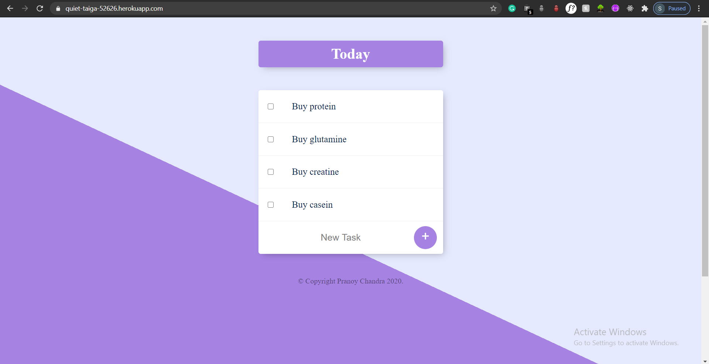

# Daily-Planner
### To-do-list web-based application. You can write down all your task and as you complete it drop it down from the app.
#### This application is hosted on Heroku @ https://quiet-taiga-52626.herokuapp.com
#### Features:

###### 1. This is the Home-Screen of the application.

<hr />

###### 2. You can simply write down your task in the "New Task" area and press on the "+" button.

<hr />

###### 3. Buy clicking on the "+" button it will be added in the incomplete task-list, after completing a particular task you can click on the checkbox to mark it as complete after that it will be disapeared from the Home-Screen.

<hr />


###### If you wish to add any another feautre to it, feel free to download the project and contribute.
###### In the root directory.
```
npm install

mongod

nodemon app.js
```
